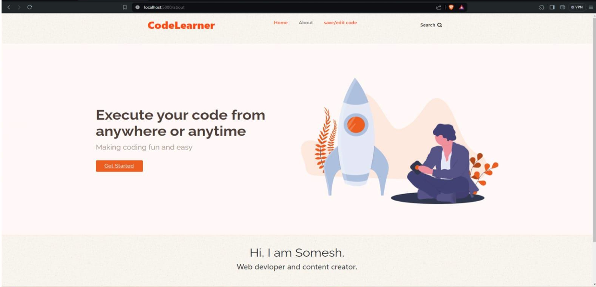
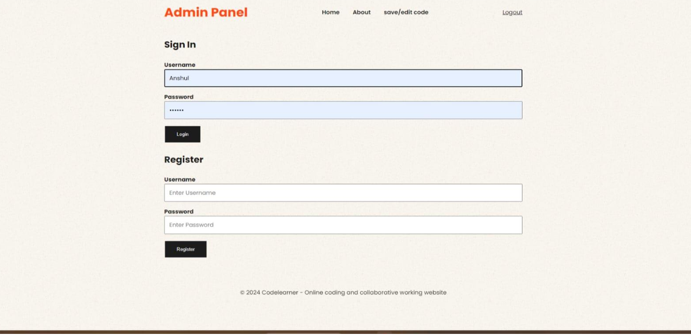
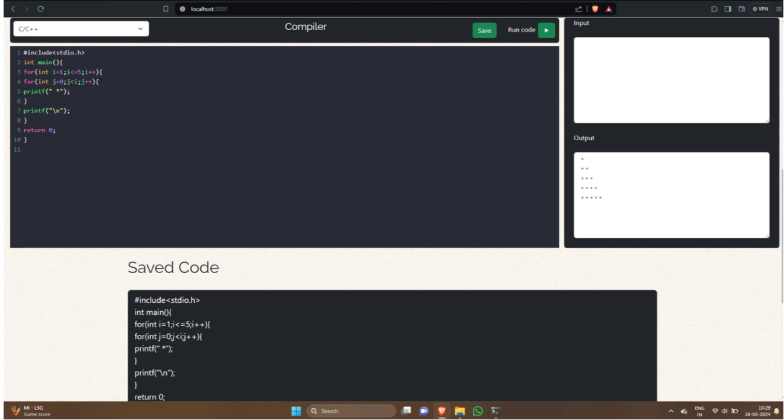
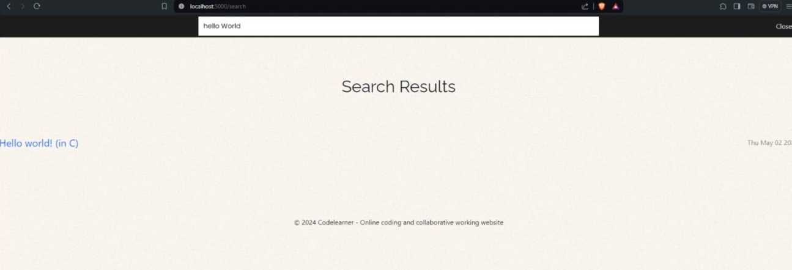
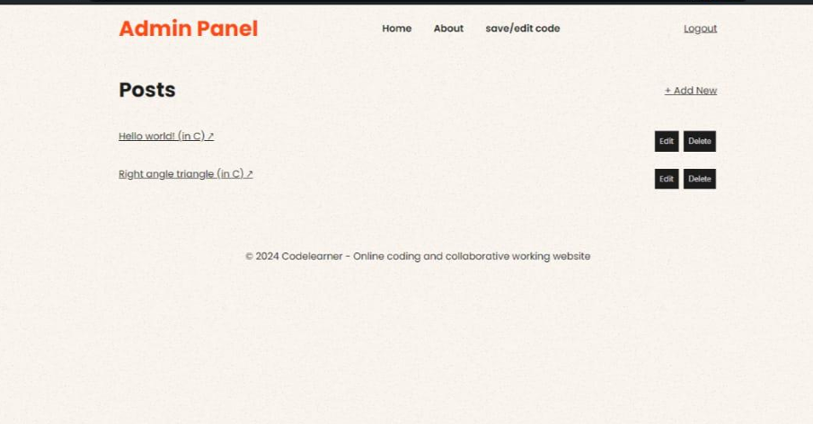

# 🖥️ Collaborative Working and Code Learning Website  

An **online compiler and collaborative coding platform** that allows users to write, execute, and learn programming together in real time. Built as a **B.Tech Major Project (2023–2024)**, it combines a compiler, collaboration tools, and a code management system into a single web-based solution.  

 <!-- Replace with actual image path from your repo -->

---

## 🚀 Features  

- **Multi-language Online Compiler**  
  Supports C, C++, Java, and Python with custom input/output execution.  

- **Collaborative Editing**  
  Multiple users can code together in real time (like Google Docs for coding).  

- **Code Saving & Management**  
  - *Quick Save*: Store code temporarily without login.  
  - *Permanent Save*: Logged-in users can save and retrieve code from MongoDB Atlas.  
  - *Search Functionality*: Search saved code by title or keywords.  

- **User Authentication**  
  Secure login/signup system with session management.  

- **Interactive UI**  
  Built using **Bootstrap** + **CodeMirror** for a modern and responsive IDE-like editor.  

- **FAQ Page**  
  Helps beginners understand usage and troubleshoot common issues.  

---

## 🛠️ Tech Stack  

**Frontend:**  
- HTML, CSS, Bootstrap, JavaScript  
- CodeMirror (for editor)  

**Backend:**  
- Node.js, Express.js  
- WebSockets (for real-time collaboration)  

**Database:**  
- MongoDB Atlas (cloud-hosted NoSQL database)  

---

## 📐 System Architecture  

The project follows a **three-tier architecture**:  
1. **Frontend (Presentation Layer):** UI built with Bootstrap + CodeMirror.  
2. **Backend (Application Layer):** Node.js + Express.js handling compiler APIs, authentication, and collaboration.  
3. **Database Layer:** MongoDB Atlas storing user data, code snippets, and search indexes.  

---

## 📸 Screenshots  

| Login / Signup | Code Editor | Search & Save | Collaboration |
|----------------|-------------|---------------|---------------|
|  |  |  |  |

---

## 📊 Results  

✅ Real-time collaborative editing tested successfully  
✅ Multi-language support (C/C++, Java, Python)  
✅ Secure authentication with session handling  
✅ Code search and retrieval from database  
✅ Clean and responsive interface  

---

## 🔮 Future Enhancements  

- Add more programming languages (JavaScript, PHP, Rust, Go, etc.)  
- Real-time chat/voice support during collaboration  
- Git-like code versioning system  
- Auto-save & offline drafts  
- Dark/Light mode themes  
- Mobile app version  
- AI-based code suggestions & bug fixes  
- Cloud deployment on AWS/Heroku/Vercel  

---

## 👨‍💻 Authors  

- **Somesh Padiyar**  
- Nisha Khati  
- Akshat Rawat  
- Anshul Gairola  
- Tanuj Gahtori  

Guided by **Mr. Vivek Uniyal**, Assistant Professor, CSE  

---

## 📄 License  

This project is part of our **B.Tech Major Project (2023–2024)** at *Institute of Technology Gopeshwar*.  
Feel free to fork, modify, and improve upon it for educational purposes.  

---

👉 [Visit the Repository](https://github.com/SomeshPadiyar/Online-compiler)  
